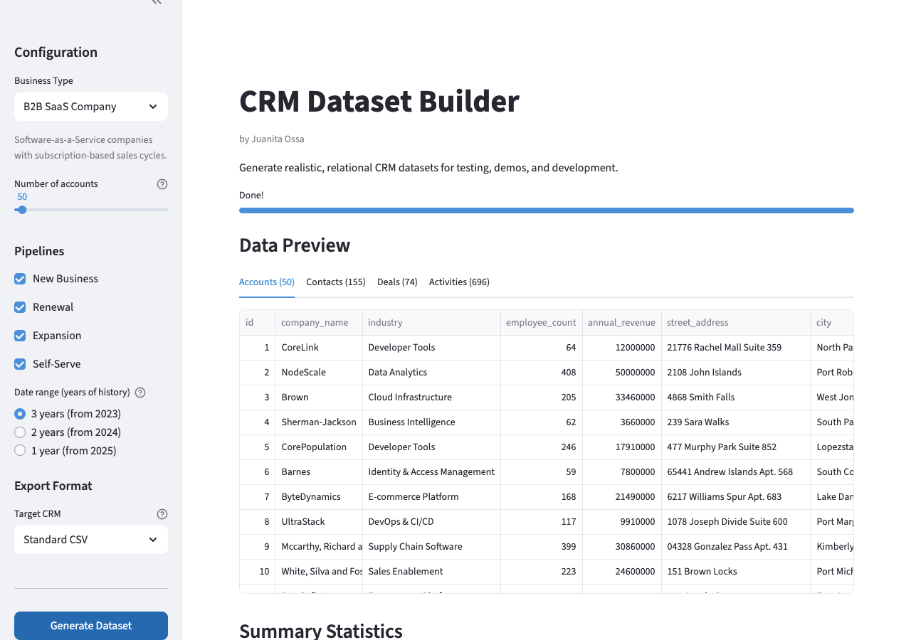

# CRM Dataset Builder

A tool for generating realistic CRM datasets — accounts, contacts, deals, and activities — with interconnected foreign keys, statistically plausible distributions, and CRM-specific export formats for HubSpot, Salesforce, and Zoho. Supports multiple business types via a profile-based architecture.

**Live demo:** [crm-dataset-builder.streamlit.app](https://crm-dataset-builder.streamlit.app)



## Business Types

Choose from three industry profiles, each with its own company names, pipelines, deal sizes, win rates, and activity patterns:

| Profile | Pipelines | Segments | ACV Range |
|---------|-----------|----------|-----------|
| **B2B SaaS** | New Business, Renewal, Expansion, Self-Serve | SMB, Mid-Market, Enterprise, Self-Serve | $600 – $350K |
| **Manufacturer** | New Accounts, Reorders, Custom/Engineered Solutions | SMB, Mid-Market, Enterprise | $5K – $5M |
| **Consultancy** | New Business, Extension, Expansion | SMB, Mid-Market, Enterprise | $25K – $2M |

**B2B SaaS** — Software companies with subscription-based sales cycles. Includes a Self-Serve (PLG) pipeline where accounts sign up, trial, and convert without sales involvement, with a small percentage converting to sales-led deals.

**Manufacturer** — Industrial manufacturers and distributors with procurement-driven sales cycles. Longer sales cycles, higher enterprise deal values, and reorder-focused renewal pipelines.

**Consultancy** — Professional services firms with engagement-based sales cycles. Deals are named by engagement type (e.g., "Digital Transformation", "M&A Due Diligence"). Extensions extend the current engagement (more time, same scope), while Expansions add new workstreams or services with existing clients.

## Generated Datasets

| File | Records (50 accounts) | Description |
|------|----------------------|-------------|
| `accounts.csv` | 50 | Companies with industry, revenue, full US addresses |
| `contacts.csv` | ~160 | 2-5 contacts per account with realistic names, titles, departments |
| `deals.csv` | ~75 | Profile-specific pipelines with outcome rates |
| `activities.csv` | ~850 | Emails, calls, meetings, LinkedIn, and notes tied to deals |

### Data Relationships

```
accounts.csv
  └── contacts.csv        (account_id → accounts.id)
  └── deals.csv           (account_id → accounts.id, contact_id → contacts.contact_id)
       └── activities.csv  (deal_id → deals.deal_id, account_id, contact_id)
```

### Key Characteristics

**Accounts** — Weighted toward smaller companies, with revenue correlated to headcount. Full US addresses with street, city, state, zip code, and region derived from state. Company names, industries, and employee tiers vary by profile.

**Contacts** — 2-5 per account, department-weighted for the business type (e.g., Sales/Marketing/CS for SaaS, Engineering/Procurement/Operations for Manufacturer). Each assigned to one of 6 profile-specific sales reps.

**Deals** — Three pipelines per profile with distinct behavior:
- **Primary pipeline** (e.g., New Business): ~70% of accounts, profile-specific win rate, segment-based cycle days
- **Renewals**: spawned ~12 months after won primary deals, high win rate
- **Expansions**: 50% chance per won primary deal, 3-9 months later
- Segment-based ACV ranges vary by profile
- Deal names vary by profile (e.g., "CompanyName 2501" for SaaS, "PO-2501-CompanyName" for Manufacturer)
- Open deals use weighted real pipeline stages (not a generic "Active" stage)
- B2B SaaS includes a Self-Serve pipeline with PLG-to-sales conversion

**Activities** — Phase-based engagement patterns:
- Won deals: 10-20 activities with strong multi-channel engagement
- Lost deals: 4-8 activities showing drop-off
- Enterprise deals generate more activities than SMB (more stakeholders)
- LinkedIn-heavy early in cycle, Meeting-heavy mid, Email-heavy late
- ~10% of accounts have zero activities (untouched imports)
- Self-serve deals have no activities (no sales rep involvement)

## CRM Export

Export datasets in CRM-specific formats ready for import into HubSpot, Salesforce, or Zoho. Each export includes:

- **Field-mapped CSVs** — columns renamed to match CRM field names
- **Association files** — relationship files using each CRM's linking method
- **Users file** — sales rep reference file with CRM-specific identifiers
- **Import guide** — step-by-step markdown guide for importing data

| CRM | Association Method | Owner Format | Key Files |
|-----|-------------------|--------------|-----------|
| **HubSpot** | Company domain matching | `sarah.chen@testcompany.com` | contacts_with_companies, deals_with_companies, deals_with_contacts |
| **Salesforce** | External ID references (ACC-N, CON-N, OPP-N) | `sarah.chen` | accounts, contacts, opportunities with External_ID__c |
| **Zoho** | Name-based matching | `sarah.chen@testcompany.com` | contacts, deals, activities with Account_Name/Contact_Name |

## Project Structure

```
crm-dataset-builder/
├── app.py                         # Streamlit web interface
├── src/
│   ├── main.py                    # CLI menu and workflow orchestration
│   ├── profiles/                  # Business-type profile definitions
│   │   ├── __init__.py            # PROFILE_REGISTRY
│   │   ├── base.py                # BaseProfile ABC
│   │   ├── b2b_saas.py            # B2BSaaSProfile
│   │   ├── manufacturer.py        # ManufacturerProfile
│   │   └── consultancy.py         # ConsultancyProfile
│   ├── generators/                # Data generation (distribution logic only)
│   │   ├── __init__.py
│   │   ├── accounts.py            # AccountGenerator
│   │   ├── contacts.py            # ContactGenerator
│   │   ├── deals.py               # DealGenerator
│   │   └── activities.py          # ActivityGenerator
│   └── exporters/                 # CRM export adapters
│       ├── __init__.py
│       ├── base.py                # BaseCRMExporter (abstract base class)
│       ├── hubspot.py             # HubSpotExporter
│       ├── salesforce.py          # SalesforceExporter
│       └── zoho.py                # ZohoExporter
├── output/                        # Generated CSV files
├── requirements.txt
└── README.md
```

### Architecture

Generators contain only distribution logic — all business-specific constants (company names, industries, pipeline stages, deal sizes, activity subjects, etc.) live in profiles. Each profile implements the `BaseProfile` abstract class, and generators/exporters accept a `profile` parameter:

```
Profile (constants)  →  Generator (logic)  →  Exporter (CRM formatting)
   B2BSaaSProfile         AccountGenerator       HubSpotExporter
   ManufacturerProfile    ContactGenerator       SalesforceExporter
   ConsultancyProfile     DealGenerator          ZohoExporter
                          ActivityGenerator
```

## Getting Started

### Web Interface (Streamlit)

```bash
pip install -r requirements.txt
streamlit run app.py
```

Select a business type, configure accounts, pipelines, date range, and export format in the sidebar.

### CLI

```bash
pip install -r requirements.txt
python src/main.py
```

The interactive menu starts with a business type selector, then lets you generate each dataset individually, all four in sequence, or export for a specific CRM:

```
Select a business type:
  1) B2B SaaS Company
  2) Manufacturer / Distributor
  3) Consultancy / Professional Services

What would you like to generate?
  1) Accounts
  2) Contacts
  3) Deals
  4) Activities
  5) All (accounts + contacts + deals + activities)
  6) Export for CRM (HubSpot, Salesforce, Zoho)
```

Datasets must be generated in order — contacts depend on accounts, deals depend on both, and activities depend on all three. CRM export (option 6) requires all four datasets to exist.

## Built With

- Python 3.x
- [Streamlit](https://streamlit.io/) for the web interface
- [Faker](https://faker.readthedocs.io/) for realistic name/company generation
- [pandas](https://pandas.pydata.org/) for data manipulation and CRM export
- Claude Code (AI-assisted development)

## License

MIT
